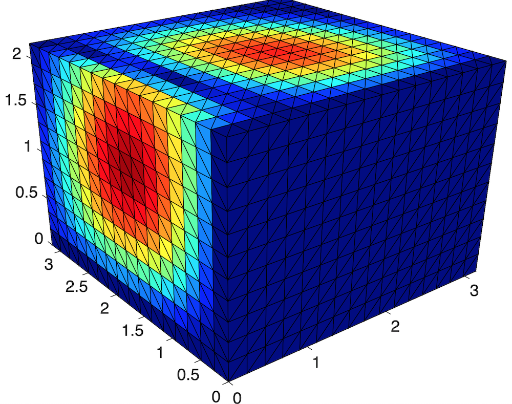
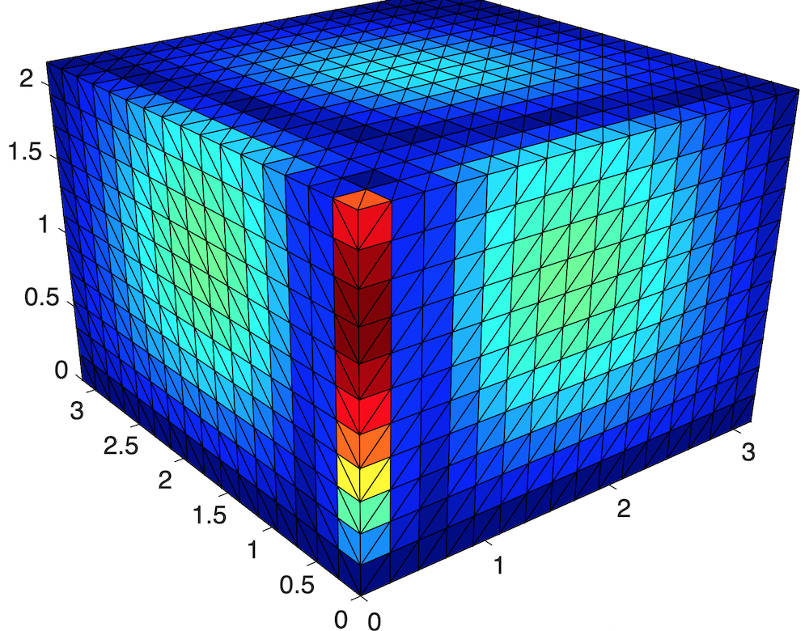
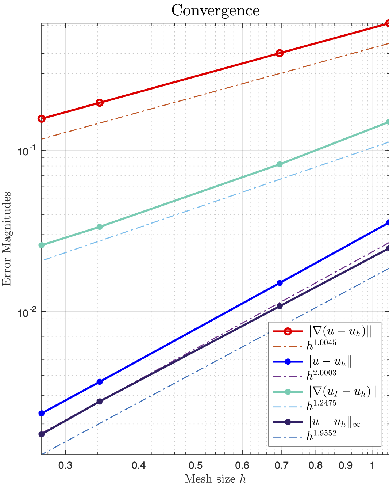

## coarsen3

- In the input and output, the ordering of arguments is changed to `bdFlag, HB` 
- To use **coarsen3** , `HB` is needed. Therefore add setup in **label3**  to initialize `HB`. 

## Version Changes

Functions in differenti versions of MATLAB might be different. To be compatible, use version check for `unique` function and `DelaunayTri` (earlier version) v.s. `delaunayTriangulation` (2014 and after).

Search  `matlabversion` in iFEM folder to find all functions affected. 

## unique

In matlab, the behavior of `unique`  has been changed.  This includes:

      -	occurrence of indices in IA and IC switched from last to first
      -	IA and IC will always be column index vectors
    
    If this change in behavior has adversely affected your code, you may 
    preserve the previous behavior with:
      
         [C,IA,IC] = unique(A,'legacy')

In ifem, we need 'last'. So in `myunique` function different call of `unique` is provided depending on the version of matlab. 

## Neumann problem

Previously I pitch one point and set `u(1) = 0` , i.e. `freeNode = 2:N` and `fixedNode =1`. After that, enforce $\int_{\Omega} u = 0$ by a constant shift.  

But this requires the exact solution satisfies the condition $u(x(1))=0$ which then fails for some data. In 2D, `Poissonfemrate` use `sincosdata` will give rate 1.8 while change to `sincosNeuman` will give optimal order 2. 

In 3-D, the problem is worse. Rate 1.5 for Neuman and 1.3 for Robin for the error $\|u_I - u_h\|_{\infty}$ . 

That's reasonable. Solution to Neumann problem is not unique. We don't know the constant and thus measured the maximum norm is not a well defined problem.

The question we should ask is:

**is the solution we computed ONE solution of the system Au = f ?**

So in the new formulation, I perturbe the matrix by `A(1,1) = A(1,1) + 1e-6`. Then the matrix is non-singular and use `mg` to solve the linear system. 

The accuracy is still the same. No optimal order measured in the maximum norm.

One reason I suspect is the ill-conditioning of the sub-matrix. In 3-D, it is $h^{-3}$ while in 2D is $h^{-2}(1+|\log h|)$.

 **Reference**

- P.B. Bochev, R.B. Lehoucq, On the Finite Element Solution of the Pure Neumann Problem, SIAM Rev. 47 (2005) 50–66.

My MG solver works pretty well but probably the ill-condition brings an issue to the perturbated problem.

The problem is still the same. We didn't find a solution to $Au = b$ but a perturbated one. The perturbation is small in average (L2 type norm) but can be a problem for maximum problem. 

Here is a simple perturbed analysis. We are solving $ (A + \epsilon) u_{\epsilon} = b$. Substract the equation $(A+\epsilon )u = b + \epsilon u$ to get the equation $ (A + \epsilon) e = \epsilon u$ and thus $\|e\|\leq \| (A+\epsilon)^{-1}\|\|\epsilon u\|$. The matrix $A$ is singular and if $\epsilon < \lambda_2$,  the norm $\| (A+\epsilon)^{-1}\| = \epsilon^{-1}$ and no control of the error. This is the stability issue due to the ill-conditioned matrix. 

To solve the problem, we need to formulate a saddle point system to enforce the constaint $\int_{\Omega}u =0$ into the system which is not straight forward. 

**Conclusion** Accept the current treatment and be aware that for pure Neumann problem, the rate of the computed solution in the maximum norm could be degenerated slightly especially in 3D.  

## Robin boundary condition in 3D

Again the maximum norm of the error is not optimal and the rate is only 1.3. Shuhao did some test and seems that the geometry of the domain will affect the maximum error. The following is revised from his email.

----

For first 2 tests, I used the same $\sin(x)\sin(y)\sin(z)$ as true solutions on $(0,\pi)^3$.

- Test 1: Only $x==0$ face as Robin boundary, and I hard-coded the nodeso n z-axis as Robin nodes, not fixed DoFs; optimal rate of converge for $L_{\infty}$ norm. The error concentrates on where $\Delta u$ is big.

  

  

- Test 2: $x==0$ and $y==0$, as Robin boundary; suddenly the rate for $L_{\infty}$ becomes suboptimal, and the error concentrates on the edge where these two faces intersect.

- Test 3: Now I suspected it is caused by geometry, so I used the distmesh in ifem to generate a ball-mesh problem. The L-inf becomes optimal again for pure Robin problem in $\Omega =  {x^2+y^2+z^2 = 4}$, and the error is evenly distributed (maybe just for a few tetrahedra with bad mesh quality).

![

I think from the perspective of using Green function approach to prove $L_{\infty}$  estimate, locally $W_{2,\infty}$ is illy defined on cubes due to the exterior normal vectors is not continuous. In 2D, the problem is
kinda minimal (you only have 4 points), so we still observe $h^2|\log(h)|$ rate of convergence.

> In 2-D, the discrete Sobolev space embedding $\|v_h\|_{\infty}\lesssim (1+ |\log h|)\|\nabla v_h\|$ implies the quasi-optimal rate. 

---

Find a paper and will try later.

- M. Juntunen, R. Stenberg, *Nitsche’s method for general boundary conditions*, Math. Comp. 78 (2009) 1353–1374.

The boundary condition is 
$$
\frac{\partial u}{\partial n}=\frac{1}{\epsilon}\left(u_{0}-u\right)+g \quad \text { on } \Gamma
$$
As $\epsilon \to \infty$, we obtain Neumann boundary condition and $\epsilon \to 0$ to get Dirichlet boundary condition.   

The convergence is 
$$
\left\|\nabla\left(u-u_{h}\right)\right\|_{L^{2}(\Omega)}+\epsilon^{-1 / 2}\left\|u-u_{h}\right\|_{L^{2}(\Gamma)} \leq C h^{s-1}\left(1+h_{\Gamma}^{1 / 2} \epsilon^{-1 / 2}\right)\|u\|_{H^{s}(\Omega)}
$$

The condition number is 
$$
\kappa=\mathcal{O}\left(h^{-2}+(\epsilon h)^{-1}\right)
$$

## FreeNode, FreeEdge, FreeDof

Change them to logical arrays. It might cause error when `lenght(freeNode)` is used. 