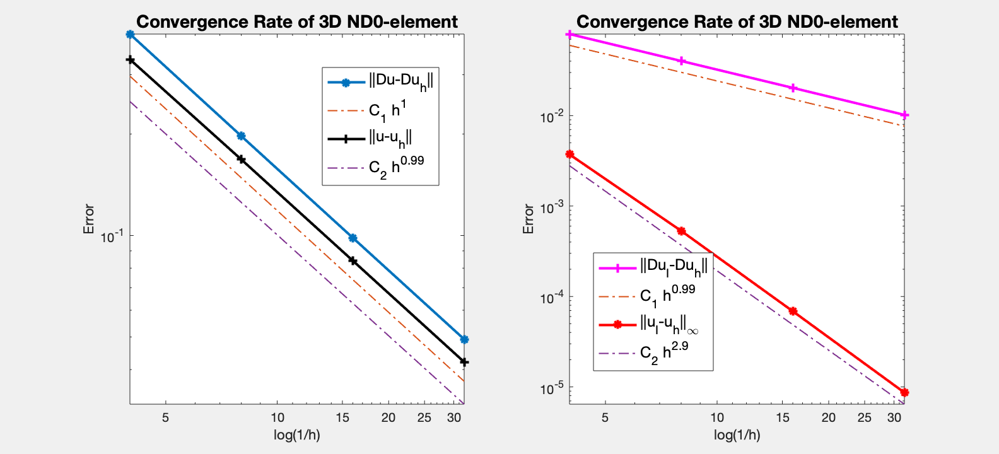
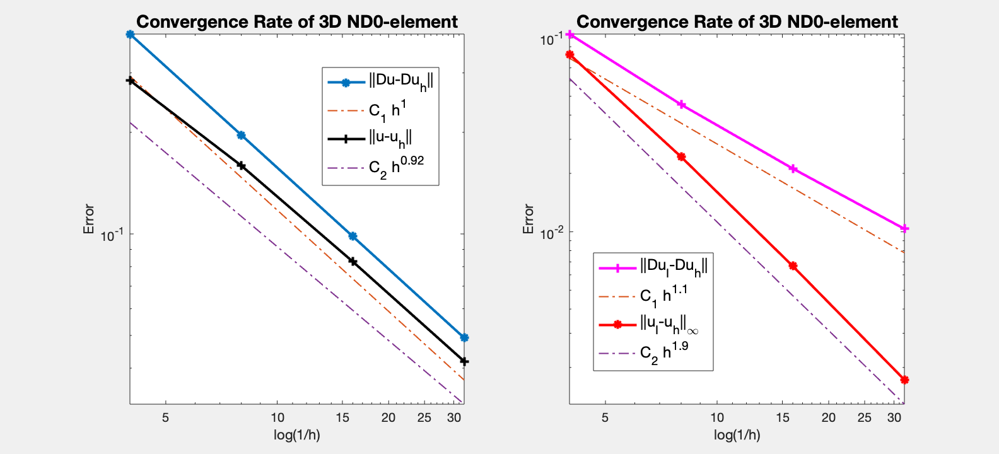

This example is to show the lowest order edge element approximation of the electric field of the time harmonic Maxwell equation.
  
$$
\begin{aligned}
\nabla \times (\mu^{-1}\nabla \times  u) - \omega^2 \varepsilon \, u &= J  \quad  \text{ in } \quad \Omega,  
\\
n \times u &= n \times g_D  \quad  \text{ on } \quad \Gamma_D,
\\
n \times (\mu^{-1}\nabla \times  u) &= n \times g_N  \quad  \text{ on } \quad \Gamma_N.
\end{aligned}
$$


based on the weak formulation

$$(\mu^{-1}\nabla \times  u, \nabla \times  v) - (\omega^2\varepsilon u,v) = (J,v) - \langle n \times g_N,v \rangle_{\Gamma_N}.$$

**Reference**
- [Finite Element Methods for Maxwell Equations](http://www.math.uci.edu/~chenlong/226/FEMMaxwell.pdf)
- [Programming of Finite Element Methods for Maxwell Equations](http://www.math.uci.edu/~chenlong/226/codeMaxwell.pdf)

**Subroutines**:

    - Maxwell
    - cubeMaxwell
    - femMaxwell3
    - Maxwellfemrate
    
The method is implemented in `Maxwell` subroutine and tested in `cubeMaxwell`. Together with other elements (ND0,ND1,ND2), `femMaxwell3` provides a concise interface to solve Maxwell equation. The ND0 element is tested in `Maxwellfemrate`. This doc is based on `Maxwellfemrate`.    

## Data Structure

Use the function

    [elem2dof,edge,elem2edgeSign] = dof3edge(elem);

to construct the pointer from element index to edge index. Read
[Dof on Edges in Three Dimensions]({{site.baseurl}}) for details.


```matlab
node = [1,0,0; 0,1,0; 0,0,0; 0,0,1];
elem = [1 2 3 4];
localEdge = [1 2; 1 3; 1 4; 2 3; 2 4; 3 4];
set(gcf,'Units','normal'); 
set(gcf,'Position',[0.25,0.25,0.25,0.25]);
showmesh3(node,elem);
view(-72,9);
findnode3(node);
findedge(node,localEdge,'all','vec');
```


    

    


The six dofs associated to edges in a tetrahedron is sorted in the ordering `[1 2; 1 3; 1 4; 2 3; 2 4; 3 4]`. Here `[1 2 3 4]` are local indices of vertices.

Globally we use ascend ordering for each element and thus the orientation of the edge is consistent. No need of `elem2edgeSign`. Read [Simplicial complex in three dimensions]({{ site.baseurl }}) for more discussion of indexing, ordering and orientation.

## Local Bases
Suppose `[i,j]` is the kth edge and `i<j`. The basis is given by 

$$ \phi _k = \lambda_i\nabla \lambda_j - \lambda_j \nabla \lambda_i,\qquad
   \nabla \times \phi_k = 2\nabla \lambda_i \times \nabla \lambda_j.$$

Inside one tetrahedron, the 6 bases functions along with their curl
corresponding to 6 local edges `[1 2; 1 3; 1 4; 2 3; 2 4; 3 4]` are

$$ \phi_1 = \lambda_1\nabla\lambda_2 - \lambda_2\nabla\lambda_1,\qquad
   \nabla \times \phi_1 = 2\nabla\lambda_1\times \nabla\lambda_2,$$

$$ \phi_2 = \lambda_1\nabla\lambda_3 - \lambda_3\nabla\lambda_1,\qquad
   \nabla \times \phi_2 = 2\nabla\lambda_1\times \nabla\lambda_3,$$

$$ \phi_3 = \lambda_1\nabla\lambda_4 - \lambda_4\nabla\lambda_1,\qquad
   \nabla \times \phi_3 = 2\nabla\lambda_1\times \nabla\lambda_4,$$

$$ \phi_4 = \lambda_2\nabla\lambda_3 - \lambda_3\nabla\lambda_2,\qquad
   \nabla \times \phi_4 = 2\nabla\lambda_2\times \nabla\lambda_3,$$

$$ \phi_5 = \lambda_2\nabla\lambda_4 - \lambda_4\nabla\lambda_2,\qquad
   \nabla \times \phi_5 = 2\nabla\lambda_2\times \nabla\lambda_4,$$

$$ \phi_6 = \lambda_3\nabla\lambda_4 - \lambda_4\nabla\lambda_3,\qquad
   \nabla \times \phi_6 = 2\nabla\lambda_3\times \nabla\lambda_4.$$


## Degree of freedoms

Suppose `[i,j]` is the kth edge and `i<j`. The corresponding degree of freedom is

$$l_k (v) = \int_{e_k} v\cdot t \, {\rm d}s \approx \frac{1}{2}[v(i)+v(j)]\cdot e_{k}.$$

It is dual to the basis $\{\phi_k\}$ in the sense that

$$l_{\ell}(\phi _k) = \delta_{k,\ell}.$$


## Dirichlet boundary condition


```matlab
%% Setting
[node,elem] = cubemesh([-1,1,-1,1,-1,1],1);
mesh = struct('node',node,'elem',elem);
option.L0 = 1;
option.maxIt = 4;
option.elemType = 'ND0';
option.printlevel = 1;

%% Dirichlet boundary condition.
fprintf('Dirichlet boundary conditions. \n');    
pde = Maxwelldata2;
bdFlag = setboundary3(node,elem,'Dirichlet');
femMaxwell3(mesh,pde,option);
```

    Dirichlet boundary conditions. 
    #dof:      604, Direct solver    0 
    #dof:     4184, Direct solver 0.03 
    Conjugate Gradient Method using HX preconditioner 
    #dof:    31024,   #nnz:   411904,   iter: 26,   err = 7.0419e-09,   time = 0.54 s
    Conjugate Gradient Method using HX preconditioner 
    #dof:   238688,   #nnz:  3525680,   iter: 29,   err = 5.6720e-09,   time =  3.5 s
    Table: Error
     #Dof        h        ||u-u_h||    ||Du-Du_h||   ||DuI-Du_h|| ||uI-u_h||_{max}
    
       604   2.500e-01   3.33015e-01   3.96024e-01   7.98367e-02   3.72532e-03
      4184   1.250e-01   1.68028e-01   1.97196e-01   4.02280e-02   5.32169e-04
     31024   6.250e-02   8.42042e-02   9.84691e-02   2.02873e-02   6.87268e-05
    238688   3.125e-02   4.21257e-02   4.92119e-02   1.01979e-02   8.65951e-06
    
    Table: CPU time
     #Dof    Assemble     Solve      Error      Mesh    
    
       604   2.00e-02   0.00e+00   2.00e-02   0.00e+00
      4184   5.00e-02   3.00e-02   7.00e-02   1.00e-02
     31024   3.60e-01   5.40e-01   3.00e-01   5.00e-02
    238688   2.95e+00   3.48e+00   2.23e+00   0.00e+00
    


    

    


## Pure Neumann boundary condition


```matlab
fprintf('Neumann boundary condition. \n');
option.plotflag = 0;
pde = Maxwelldata2;
mesh.bdFlag = setboundary3(node,elem,'Neumann');
femMaxwell3(mesh,pde,option);
```

    Neumann boundary condition. 
    #dof:      604, Direct solver 0.01 
    #dof:     4184, Direct solver 0.04 
    Conjugate Gradient Method using HX preconditioner 
    #dof:    31024,   #nnz:   482608,   iter: 18,   err = 5.5383e-09,   time = 0.41 s
    Conjugate Gradient Method using HX preconditioner 
    #dof:   238688,   #nnz:  3814496,   iter: 19,   err = 4.7105e-09,   time =  2.6 s
    Table: Error
     #Dof        h        ||u-u_h||    ||Du-Du_h||   ||DuI-Du_h|| ||uI-u_h||_{max}
    
       604   2.500e-01   2.85095e-01   3.91208e-01   1.04607e-01   8.22886e-02
      4184   1.250e-01   1.59317e-01   1.96376e-01   4.52796e-02   2.43444e-02
     31024   6.250e-02   8.27814e-02   9.83230e-02   2.11913e-02   6.66042e-03
    238688   3.125e-02   4.19067e-02   4.91846e-02   1.03572e-02   1.72821e-03
    
    Table: CPU time
     #Dof    Assemble     Solve      Error      Mesh    
    
       604   3.00e-02   1.00e-02   3.00e-02   0.00e+00
      4184   8.00e-02   4.00e-02   7.00e-02   0.00e+00
     31024   3.60e-01   4.10e-01   2.90e-01   5.00e-02
    238688   2.86e+00   2.58e+00   2.20e+00   0.00e+00
    


    

    


## Conclusion 

The optimal rate of convergence of both the H(curl)-norm and L2-norm (1st order) is observed. The 2nd order convergent rate between two discrete functions $\| \nabla \times (u_I - u_h) \|_{\infty}$ is known as superconvergence.

MGCG using HX preconditioner converges uniformly in all cases.
