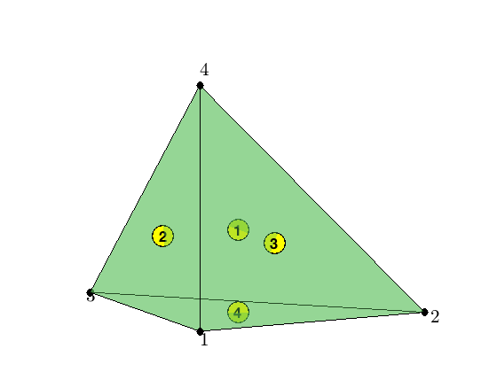
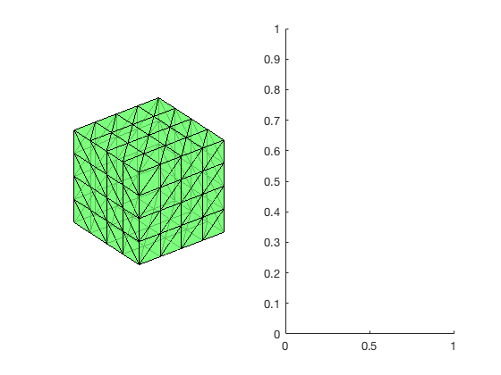
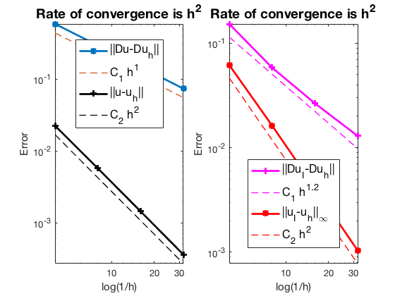
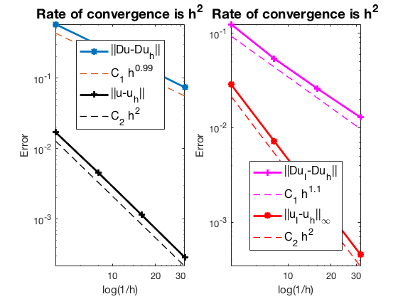

This example is to show the rate of convergence of the CR Nonconforming finite element approximation of the Poisson equation on the unit cube:

$$- \Delta u = f \; \hbox{in } (0,1)^3$$

for the following boundary conditions
- Non-empty Dirichlet boundary condition: $u=g_D \hbox{ on }\Gamma_D, \nabla u\cdot n=g_N \hbox{ on }\Gamma_N.$
- Pure Neumann boundary condition: $\nabla u\cdot n=g_N \hbox{ on } \partial \Omega$.
- Robin boundary condition: $g_R u + \nabla u\cdot n=g_N \hbox{ on }\partial \Omega$.

**References**:
- [Quick Introduction to Finite Element Methods](femdoc.html)
- [Introduction to Finite Element Methods](http://www.math.uci.edu/~chenlong/226/Ch2FEM.pdf)
- [Progamming of Finite Element Methods](http://www.math.uci.edu/~chenlong/226/Ch3FEMCode.pdf)

**Subroutines**:

    - Poisson3CR
    - cubePoisson
    - femPoisson3
    - Poisson3CRfemrate
    
The method is implemented in `Poisson3CR` subroutine and tested in `cubePoissonCR`. Together with other elements (P1,P2,Q1,WG,CR), `femPoisson3` provides a concise interface to solve Poisson equation. The CR element is tested in `Poisson3CRfemrate`. This doc is based on `Poisson3CRfemrate`.    

## CR Nonconforming Element

We explain degree of freedoms and basis functions for Crouzeix-Raviart nonconforming P1 element on a tetrahedron. The dofs are associated to faces. Given a mesh, the required data structure can be constructured by

    [elem2face,face] = dof3face(elem);
      
### Local indexing      


```matlab
node = [0,0,0; 1,0,0; 0,1,0; 0,0,1];
elem = [1 2 3 4];
face = [2 3 4; 1 3 4; 1 2 4; 1 2 3];
showmesh3(node,elem); view([-26 10]);
findnode3(node);
findelem(node,face);
```


    

    


### A Local Basis

The 4 Lagrange-type bases functions are denoted by $\phi_i, i=1:4$, i.e. $\phi_i(m_j)=\delta _{ij},i,j=1:4$, where $m_i$ is the center of the i-th face. In barycentric coordinates, they are:

$$\phi_i = 1- 2\lambda_i,\quad \nabla \phi_i = -2\nabla \lambda_i,\quad i =1:4.$$

When transfer to the reference triangle formed by $(0,0,0),(1,0,0),(0,1,0),(0,0,1)$, the local bases in x-y-z coordinate can be obtained by substituting 

$$\lambda _1 = x, \quad \lambda _2 = y, \quad \lambda _3 = z, \quad \lambda_4 = 1-x-y-z.$$ 

## Mixed boundary condition


```matlab
%% Setting
[node,elem] = cubemesh([0,1,0,1,0,1],0.5); 
mesh = struct('node',node,'elem',elem);
option.L0 = 1;
option.maxIt = 4;
option.elemType = 'CR';
option.printlevel = 1;
option.plotflag = 1;
```


```matlab
%% Non-empty Dirichlet boundary condition.
pde = sincosdata3;
mesh.bdFlag = setboundary3(node,elem,'Dirichlet','~(x==0)','Neumann','x==0');
femPoisson3(mesh,pde,option);
```

    Multigrid V-cycle Preconditioner with Conjugate Gradient Method
    #dof:     6528,  #nnz:    23040, smoothing: (1,1), iter: 17,   err = 7.80e-09,   time =  0.1 s
    Multigrid V-cycle Preconditioner with Conjugate Gradient Method
    #dof:    50688,  #nnz:   190464, smoothing: (1,1), iter: 17,   err = 9.10e-09,   time = 0.25 s
    Multigrid V-cycle Preconditioner with Conjugate Gradient Method
    #dof:   399360,  #nnz:  1548288, smoothing: (1,1), iter: 17,   err = 9.78e-09,   time =  2.6 s
    Table: Error
     #Dof        h        ||u-u_h||    ||Du-Du_h||   ||DuI-Du_h|| ||uI-u_h||_{max}
    
       864   2.500e-01   1.57877e-02   5.75062e-01   1.15791e-01   1.49758e-02
      6528   1.250e-01   4.18680e-03   2.93247e-01   5.28394e-02   4.03690e-03
     50688   6.250e-02   1.06111e-03   1.47388e-01   2.58754e-02   1.05299e-03
    399360   3.125e-02   2.66154e-04   7.37911e-02   1.28726e-02   2.66527e-04
    
    Table: CPU time
     #Dof    Assemble     Solve      Error      Mesh    
    
       864   1.10e-01   7.92e-03   1.00e-01   2.00e-02
      6528   5.00e-02   1.02e-01   5.00e-02   1.00e-02
     50688   2.10e-01   2.47e-01   2.10e-01   1.00e-01
    399360   2.42e+00   2.60e+00   1.47e+00   0.00e+00
    


    

    


    

    


## Pure Neumann boundary condition

When pure Neumann boundary condition is posed, i.e., $-\Delta u =f$ in $\Omega$ and $\nabla u\cdot n=g_N$ on $\partial \Omega$, the data should be consisitent in the sense that $\int_{\Omega} f \, dx + \int_{\partial \Omega} g \, ds = 0$. The solution is unique up to a constant. A post-process is applied such that the constraint $\int_{\Omega}u_h dx = 0$ is imposed. 


```matlab
%% Pure Neumann boundary condition.
option.plotflag = 0;
mesh.bdFlag = setboundary3(node,elem,'Neumann');
femPoisson3(mesh,pde,option);
```

    Multigrid V-cycle Preconditioner with Conjugate Gradient Method
    #dof:     6528,  #nnz:    24957, smoothing: (1,1), iter: 20,   err = 7.43e-09,   time = 0.092 s
    Multigrid V-cycle Preconditioner with Conjugate Gradient Method
    #dof:    50688,  #nnz:   198141, smoothing: (1,1), iter: 21,   err = 4.01e-09,   time = 0.24 s
    Multigrid V-cycle Preconditioner with Conjugate Gradient Method
    #dof:   399360,  #nnz:  1579005, smoothing: (1,1), iter: 22,   err = 4.23e-09,   time =  2.7 s
    Table: Error
     #Dof        h        ||u-u_h||    ||Du-Du_h||   ||DuI-Du_h|| ||uI-u_h||_{max}
    
       864   2.500e-01   2.24448e-02   5.86299e-01   1.53064e-01   6.19341e-02
      6528   1.250e-01   5.72292e-03   2.94670e-01   5.84934e-02   1.63182e-02
     50688   6.250e-02   1.43932e-03   1.47567e-01   2.66183e-02   4.13880e-03
    399360   3.125e-02   3.60390e-04   7.38135e-02   1.29661e-02   1.03857e-03
    
    Table: CPU time
     #Dof    Assemble     Solve      Error      Mesh    
    
       864   4.00e-02   1.86e-03   2.00e-02   1.00e-02
      6528   3.00e-02   9.16e-02   3.00e-02   1.00e-02
     50688   2.10e-01   2.37e-01   1.30e-01   7.00e-02
    399360   2.74e+00   2.70e+00   1.41e+00   0.00e+00
    


    

    


## Robin boundary condition


```matlab
%% Pure Robin boundary condition.
pde = sincosRobindata3;
mesh.bdFlag = setboundary3(node,elem,'Robin');
femPoisson3(mesh,pde,option);
```

    Multigrid V-cycle Preconditioner with Conjugate Gradient Method
    #dof:     6528,  #nnz:    24960, smoothing: (1,1), iter: 17,   err = 3.83e-09,   time = 0.074 s
    Multigrid V-cycle Preconditioner with Conjugate Gradient Method
    #dof:    50688,  #nnz:   198144, smoothing: (1,1), iter: 17,   err = 7.40e-09,   time = 0.31 s
    Multigrid V-cycle Preconditioner with Conjugate Gradient Method
    #dof:   399360,  #nnz:  1579008, smoothing: (1,1), iter: 17,   err = 7.34e-09,   time =    3 s
    Table: Error
     #Dof        h        ||u-u_h||    ||Du-Du_h||   ||DuI-Du_h|| ||uI-u_h||_{max}
    
       864   2.500e-01   1.70968e-02   5.78078e-01   1.24451e-01   2.87371e-02
      6528   1.250e-01   4.51894e-03   2.93659e-01   5.40040e-02   7.24170e-03
     50688   6.250e-02   1.14572e-03   1.47441e-01   2.60230e-02   1.82017e-03
    399360   3.125e-02   2.87439e-04   7.37977e-02   1.28910e-02   4.57164e-04
    
    Table: CPU time
     #Dof    Assemble     Solve      Error      Mesh    
    
       864   5.00e-02   9.15e-04   0.00e+00   0.00e+00
      6528   3.00e-02   7.44e-02   2.00e-02   1.00e-02
     50688   2.00e-01   3.09e-01   1.70e-01   7.00e-02
    399360   2.16e+00   3.05e+00   1.48e+00   0.00e+00
    


    

    


## Conclusion


The optimal rate of convergence of the H1-norm (1st order) and L2-norm (2nd order) is observed. No superconvergence for $\|\nabla u_I - \nabla u_h\|$.

MGCG converges uniformly in all cases.
