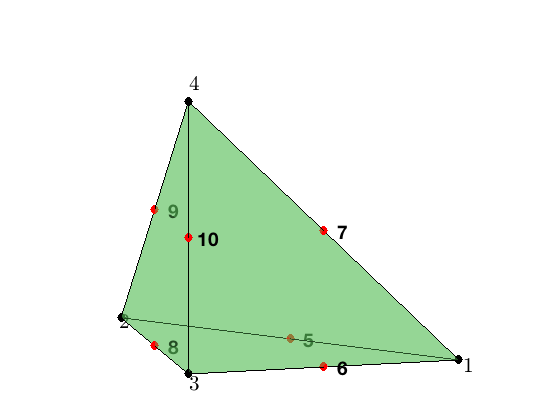
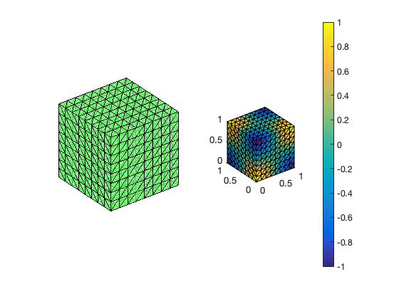

This example is to show the rate of convergence of the linear finite element approximation of the Poisson equation on the unit square:

$$- \Delta u = f \; \hbox{in } (0,1)^3$$

for the following boundary conditions
- Non-empty Dirichlet boundary condition: $u=g_D \hbox{ on }\Gamma_D, \nabla u\cdot n=g_N \hbox{ on }\Gamma_N.$
- Pure Neumann boundary condition: $\nabla u\cdot n=g_N \hbox{ on } \partial \Omega$.
- Robin boundary condition: $g_R u + \nabla u\cdot n=g_N \hbox{ on }\partial \Omega$.

**References**:
- [Quick Introduction to Finite Element Methods](femdoc.html)
- [Introduction to Finite Element Methods](http://www.math.uci.edu/~chenlong/226/Ch2FEM.pdf)
- [Progamming of Finite Element Methods](http://www.math.uci.edu/~chenlong/226/Ch3FEMCode.pdf)

**Subroutines**:

    - Poisson3P2
    - cubePoissonP2
    - femPoisson3
    - Poisson3P2femrate
    
The method is implemented in `Poisson3P2` subroutine and tested in `cubePoissonP2`. Together with other elements (P1, P2,Q1,WG), `femPoisson3` provides a concise interface to solve Poisson equation. The P2 element is tested in `Poisson3P2femrate`. This doc is based on `Poisson3P2femrate`.    

## P2 Quadratic Element

For the quadratic element on a tetrahedron, the local basis functions can be written in terms of barycentric coordinates. The 10 dofs is displayed below. The first 4 are associated to the vertices and 6 to the middle points of 6 edges. 

Given a mesh, the required data structure can be constructured by
        
        [elem2dof,edge,bdDof] = dof3P2(elem)


### Local indexing

The tetrahedron consists of four vertices indexed as [1 2 3 4]. Each tetrahedron contains four faces and six edges. They can be indexed as

    locFace = [2 3 4; 1 4 3; 1 2 4; 1 3 2];
    locEdge = [1 2; 1 3; 1 4; 2 3; 2 4; 3 4];

In `locFace`, the i-th face is opposite to the i-th vertices and the orientation is induced from the tetrahedronthus this is called _opposite indexing_. In `locEdge`, it is the _lexicographic indexing_ which is induced from the lexicographic ordering of the six edges. 


```matlab
node = [1,0,0; 0,1,0; 0,0,0; 0,0,1];
elem = [1 2 3 4];
locEdge = [1 2; 1 3; 1 4; 2 3; 2 4; 3 4];
showmesh3(node,elem);
view(-14,12);
findnode3(node);
findedgedof3(node,locEdge);
```


    

    


### Boundary dof

When implement boundary conditions, we need to find the d.o.f associated to boundary faces. For example, for Neumann boundary conditions, it can be found by

               bdFace2dof = [elem2dof(bdFlag(:,1) == 2,[2,3,4,10,9,8]); ...  
                             elem2dof(bdFlag(:,2) == 2,[1,4,3,10,6,7]); ...
                             elem2dof(bdFlag(:,3) == 2,[1,2,4,9,7,5]); ...
                             elem2dof(bdFlag(:,4) == 2,[1,3,2,8,5,6])];

### A local basis

The 10 Lagrange-type bases functions are denoted by $\phi_i, i=1:10$. In barycentric coordinates, they are 

$$ \phi_1 = \lambda_1(2\lambda_1 -1),\quad \nabla \phi_1 = \nabla \lambda_1(4\lambda_1-1),$$

$$ \phi_2 = \lambda_2(2\lambda_2 -1),\quad  \nabla \phi_2 = \nabla \lambda_2(4\lambda_2-1),$$ 

$$ \phi_3 = \lambda_3(2\lambda_3 -1),\quad  \nabla \phi_3 = \nabla \lambda_3(4\lambda_3-1),$$ 

$$ \phi_4 = \lambda_4(2\lambda_4 -1),\quad  \nabla \phi_4 = \nabla \lambda_4(4\lambda_4-1),$$ 

$$ \phi_5 = 4\lambda_1\lambda_2,\quad  \nabla\phi_5 = 4\left (\lambda_1\nabla \lambda_2 + \lambda_2\nabla \lambda_1\right )\; ,$$ 

$$ \phi_6 = 4\lambda _1\lambda_3,\quad  \nabla\phi_6 = 4\left (\lambda_1\nabla \lambda_3 + \lambda_3\nabla \lambda_1\right )\; ,$$ 

$$ \phi_7 = 4\lambda _1\lambda_4,\quad  \nabla\phi_7 = 4\left (\lambda_1\nabla \lambda_4 + \lambda_4\nabla\lambda_1\right )\; .$$

$$ \phi_8 = 4\lambda _2\lambda_3,\quad  \nabla\phi_8 = 4\left (\lambda_2\nabla \lambda_3 + \lambda_3\nabla \lambda_2\right )\; ,$$ 

$$ \phi_9 = 4\lambda _2\lambda_4,\quad  \nabla\phi_9 = 4\left (\lambda_2\nabla \lambda_4 + \lambda_4\nabla \lambda_2\right )\; ,$$ 

$$ \phi_{10} = 4\lambda _3\lambda_4,\quad  \nabla\phi_{10} = 4\left (\lambda_3\nabla \lambda_4 + \lambda_4\nabla \lambda_3\right )\; .$$ 


When transfer to the reference triangle formed by $(0,0,0),(1,0,0),(0,1,0),(0,0,1)$, the local bases in x-y-z coordinate can be obtained by substituting 

$$\lambda _1 = x, \quad \lambda _2 = y, \quad \lambda _3 = z, \quad \lambda_4 = 1-x-y-z.$$ 

Unlike 2-D case, to apply uniform refinement to obtain a fine mesh with good mesh quality, a different ordering of the inital mesh, which may violate the positive ordering, should be used. See [3 D Red Refinement](uniformrefine3doc.html).

## Mixed boundary condition


```matlab
%% Setting
[node,elem] = cubemesh([0,1,0,1,0,1],1/3); 
mesh = struct('node',node,'elem',elem);
option.maxIt = 4;
option.elemType = 'P2';
option.printlevel = 1;
option.plotflag = 1;
```


```matlab
%% Non-empty Dirichlet boundary condition.
fprintf('Mixed boundary conditions. \n');    
% pde = polydata3;
pde = sincosdata3;
mesh.bdFlag = setboundary3(node,elem,'Dirichlet','~(x==0)','Neumann','x==0');
femPoisson3(mesh,pde,option);
```

    Mixed boundary conditions. 
    
     Multigrid V-cycle Preconditioner with Conjugate Gradient Method
    #dof:     3600,  #nnz:    70718, smoothing: (1,1), iter: 12,   err = 2.83e-09,   time = 0.13 s
    
     Multigrid V-cycle Preconditioner with Conjugate Gradient Method
    #dof:    30752,  #nnz:   659134, smoothing: (1,1), iter: 12,   err = 3.80e-09,   time = 0.38 s
    
     Multigrid V-cycle Preconditioner with Conjugate Gradient Method
    #dof:   254016,  #nnz:  5674430, smoothing: (1,1), iter: 12,   err = 3.57e-09,   time =  2.2 s
    Table: Error
     #Dof        h        ||u-u_h||    ||Du-Du_h||   ||DuI-Du_h|| ||uI-u_h||_{max}
    
       729   2.500e-01   5.00700e-03   1.32387e-01   5.25032e-02   1.21275e-02
      4913   1.250e-01   6.03477e-04   3.52893e-02   9.25606e-03   1.61600e-03
     35937   6.250e-02   7.43413e-05   9.04712e-03   1.42917e-03   2.02649e-04
    274625   3.125e-02   9.26851e-06   2.28115e-03   2.17441e-04   2.52582e-05
    
    Table: CPU time
     #Dof    Assemble     Solve      Error      Mesh    
    
       729   1.10e-01   2.00e-02   1.20e-01   1.00e-02
      4913   1.90e-01   1.30e-01   1.00e-01   1.00e-02
     35937   8.80e-01   3.80e-01   3.90e-01   7.00e-02
    274625   6.22e+00   2.17e+00   3.01e+00   0.00e+00
    


    

    


    

    


## Pure Neumann boundary condition

When pure Neumann boundary condition is posed, i.e., $-\Delta u =f$ in $\Omega$ and $\nabla u\cdot n=g_N$ on $\partial \Omega$, the data should be consisitent in the sense that $\int_{\Omega} f \, dx + \int_{\partial \Omega} g \, ds = 0$. The solution is unique up to a constant. A post-process is applied such that the constraint $\int_{\Omega}u_h dx = 0$ is imposed. 


```matlab
%% Pure Neumann boundary condition.
fprintf('Pure Neumann boundary condition. \n');
pde = sincosdata3Neumann;
option.plotflag = 0;
mesh.bdFlag = setboundary3(node,elem,'Neumann');
femPoisson3(mesh,pde,option);
```

    Pure Neumann boundary condition. 
    
     Multigrid V-cycle Preconditioner with Conjugate Gradient Method
    #dof:      729,  #nnz:    13921, smoothing: (1,1), iter: 11,   err = 8.36e-09,   time = 0.06 s
    
     Multigrid V-cycle Preconditioner with Conjugate Gradient Method
    #dof:     4913,  #nnz:   103105, smoothing: (1,1), iter: 12,   err = 3.57e-09,   time = 0.07 s
    
     Multigrid V-cycle Preconditioner with Conjugate Gradient Method
    #dof:    35937,  #nnz:   792961, smoothing: (1,1), iter: 12,   err = 3.77e-09,   time = 0.35 s
    
     Multigrid V-cycle Preconditioner with Conjugate Gradient Method
    #dof:   274625,  #nnz:  6218497, smoothing: (1,1), iter: 12,   err = 4.84e-09,   time =  2.2 s
    Table: Error
     #Dof        h        ||u-u_h||    ||Du-Du_h||   ||DuI-Du_h|| ||uI-u_h||_{max}
    
       729   2.500e-01   4.33972e-03   1.06671e-01   1.11359e-01   2.69023e-02
      4913   1.250e-01   5.63932e-04   3.20352e-02   2.08121e-02   5.72678e-03
     35937   6.250e-02   7.20239e-05   8.63820e-03   3.68308e-03   8.55523e-04
    274625   3.125e-02   9.12740e-06   2.22998e-03   6.44578e-04   1.14993e-04
    
    Table: CPU time
     #Dof    Assemble     Solve      Error      Mesh    
    
       729   1.00e-01   6.00e-02   4.00e-02   1.00e-02
      4913   1.60e-01   7.00e-02   9.00e-02   2.00e-02
     35937   8.10e-01   3.50e-01   4.20e-01   7.00e-02
    274625   5.80e+00   2.21e+00   2.78e+00   0.00e+00
    


    

    


## Robin boundary condition


```matlab
%% Robin boundary condition.
fprintf('Robin boundary condition. \n');
pde = sincosRobindata3;
mesh.bdFlag = setboundary3(node,elem,'Robin');
femPoisson3(mesh,pde,option);
```

    Robin boundary condition. 
    
     Multigrid V-cycle Preconditioner with Conjugate Gradient Method
    #dof:     4913,  #nnz:   105409, smoothing: (1,1), iter: 12,   err = 2.66e-09,   time = 0.05 s
    
     Multigrid V-cycle Preconditioner with Conjugate Gradient Method
    #dof:    35937,  #nnz:   802177, smoothing: (1,1), iter: 12,   err = 4.68e-09,   time = 0.35 s
    
     Multigrid V-cycle Preconditioner with Conjugate Gradient Method
    #dof:   274625,  #nnz:  6255361, smoothing: (1,1), iter: 12,   err = 8.75e-09,   time =  2.4 s
    Table: Error
     #Dof        h        ||u-u_h||    ||Du-Du_h||   ||DuI-Du_h|| ||uI-u_h||_{max}
    
       729   2.500e-01   4.44278e-03   1.19113e-01   8.29341e-02   4.13848e-02
      4913   1.250e-01   5.66084e-04   3.35620e-02   1.48538e-02   3.95143e-03
     35937   6.250e-02   7.20911e-05   8.82519e-03   2.51203e-03   3.51203e-04
    274625   3.125e-02   9.13225e-06   2.25306e-03   4.25087e-04   4.30278e-05
    
    Table: CPU time
     #Dof    Assemble     Solve      Error      Mesh    
    
       729   7.00e-02   1.00e-02   3.00e-02   0.00e+00
      4913   1.60e-01   5.00e-02   9.00e-02   2.00e-02
     35937   8.30e-01   3.50e-01   3.80e-01   7.00e-02
    274625   6.04e+00   2.36e+00   2.94e+00   0.00e+00
    


    

    


## Conclusion

The optimal rate of convergence of the H1-norm (2nd order) and L2-norm
(3rd order) is observed. Superconvergence between discrete functions
$\| \nabla u_I - \nabla u_h \|$ is only 2.5 order.

For Neumann problem, the maximum norm is only 2.6 not optimal. 

MGCG converges uniformly in all cases.
