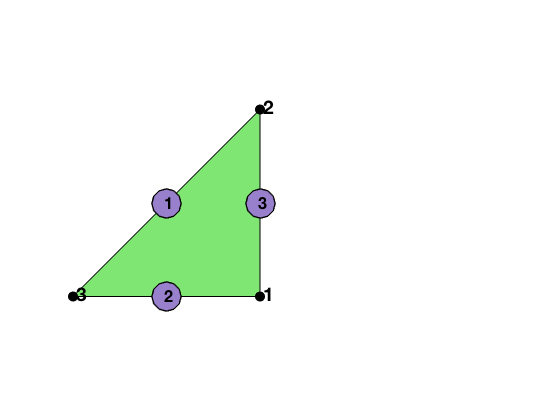
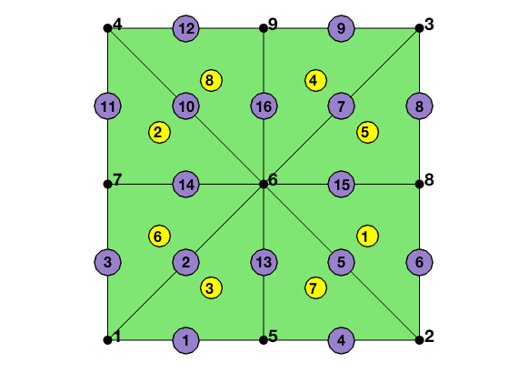
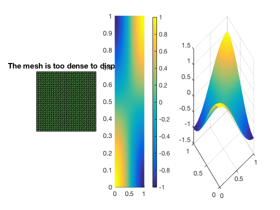
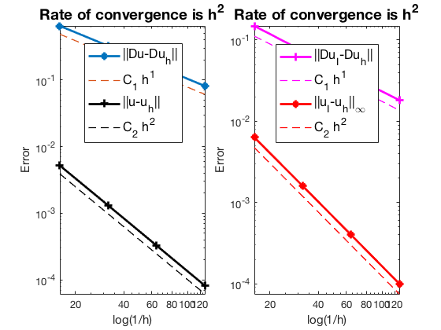
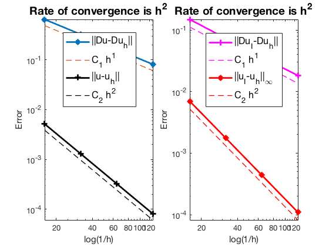

This example is to show the rate of convergence of the CR Nonconforming finite element approximation of the Poisson equation on the unit square:

$$- \Delta u = f \; \hbox{in } (0,1)^2$$

for the following boundary conditions
- Non-empty Dirichlet boundary condition: $u=g_D \hbox{ on }\Gamma_D, \nabla u\cdot n=g_N \hbox{ on }\Gamma_N.$
- Pure Neumann boundary condition: $\nabla u\cdot n=g_N \hbox{ on } \partial \Omega$.
- Robin boundary condition: $g_R u + \nabla u\cdot n=g_N \hbox{ on }\partial \Omega$.

### References
- [Quick Introduction to Finite Element Methods]({{ site.baseurl }})
- [Introduction to Finite Element Methods](http://www.math.uci.edu/~chenlong/226/Ch2FEM.pdf)
- [Progamming of Finite Element Methods](http://www.math.uci.edu/~chenlong/226/Ch3FEMCode.pdf)

### Subroutines

- `PoissonCR`
- `squarePoisson`
- `femPoisson`
- `PoissonCRfemrate`
    
The method is implemented in `PoissonCR` subroutine and can be tested in `squarePoisson`. Together with other elements (P1, P2, P3, Q1, CR), `femPoisson` provides a concise interface to solve Poisson equation. The CR element is tested in `PoissonCRfemrate`. This doc is based on `PoissonCRfemrate`.

## CR Nonconforming Element

We explain degree of freedoms and basis functions for Crouzeix-Raviart nonconforming P1 element on triangles. The dofs are associated to edges. Given a mesh, the required data structure can be constructured by

      [elem2edge,edge] = dofedge(elem);
      
### Local indexing      


```matlab
%% Local indexing of DOFs
node = [1,0; 1,1; 0,0];
elem = [1 2 3];
edge = [2 3; 3 1; 1 2];
figure;
subplot(1,2,1)
showmesh(node,elem);
findnode(node);
findedge(node,edge);
```


    

    


### A Local Basis

The 3 Lagrange-type bases functions are denoted by $\phi_i, i=1:3$, i.e. $\phi_i(m_j)=\delta _{ij},i,j=1:3$, where $m_i$ is the middle point of the i-th edge. In barycentric coordinates, they are:

$$\phi_i = 1- 2\lambda_i,\quad \nabla \phi_i = -2\nabla \lambda_i,$$

When transfer to the reference triangle formed by $(0,0),(1,0),(0,1)$, the local bases in x-y coordinate can be obtained by substituting 

$$\lambda _1 = x, \quad \lambda _2 = y, \quad \lambda _3 = 1-x-y.$$ 

### Local to global index map

The matrix `elem2edge` is the local to the global index mapping of edges. It can be constructed by 

    [elem2edge,edge] = dofedge(elem);


```matlab
node = [0,0; 1,0; 1,1; 0,1];
elem = [2,3,1; 4,1,3];      
[node,elem] = uniformbisect(node,elem);
figure(2); clf;
showmesh(node,elem);
findnode(node);
findelem(node,elem);
[elem2edge,edge] = dofedge(elem);
findedge(node,edge);
display(elem2edge);
```

    
    elem2edge =
    
      8�3 uint32 matrix
    
        5    6   15
       10   11   14
        2    1   13
        7    9   16
        7   15    8
        2   14    3
        5   13    4
       10   16   12
    


    

    


## Mixed boundary condition


```matlab
%% Setting
[node,elem] = squaremesh([0,1,0,1],0.25); 
mesh = struct('node',node,'elem',elem);
option.L0 = 2;
option.maxIt = 4;
option.printlevel = 1;
option.plotflag = 1;
option.elemType = 'CR';
```


```matlab
% Mixed boundary condition
pde = sincosdata;
mesh.bdFlag = setboundary(node,elem,'Dirichlet','~(x==0)','Neumann','x==0');
femPoisson(mesh,pde,option);
```

    Multigrid V-cycle Preconditioner with Conjugate Gradient Method
    #dof:     3136,  #nnz:    11040, smoothing: (1,1), iter: 12,   err = 2.67e-09,   time = 0.15 s
    Multigrid V-cycle Preconditioner with Conjugate Gradient Method
    #dof:    12416,  #nnz:    44608, smoothing: (1,1), iter: 12,   err = 2.62e-09,   time = 0.11 s
    Multigrid V-cycle Preconditioner with Conjugate Gradient Method
    #dof:    49408,  #nnz:   179328, smoothing: (1,1), iter: 12,   err = 2.57e-09,   time = 0.19 s
    
     #Dof       h        ||u-u_h||    ||Du-Du_h||   ||DuI-Du_h|| ||uI-u_h||_{max}
    
      800   6.250e-02   1.20226e-03   1.62318e-01   3.64423e-02   1.55737e-03
     3136   3.125e-02   3.01351e-04   8.12476e-02   1.81858e-02   3.97664e-04
    12416   1.562e-02   7.53872e-05   4.06349e-02   9.08851e-03   1.00099e-04
    49408   7.812e-03   1.88499e-05   2.03188e-02   4.54371e-03   2.50778e-05
    
     #Dof   Assemble     Solve      Error      Mesh    
    
      800   6.00e-02   8.15e-03   8.00e-02   1.00e-02
     3136   6.00e-02   1.45e-01   3.00e-02   1.00e-02
    12416   1.60e-01   1.09e-01   4.00e-02   5.00e-02
    49408   2.50e-01   1.90e-01   1.00e-01   1.50e-01
    
    


    

    


    

    


## Pure Neumann boundary condition

When pure Neumann boundary condition is posed, i.e., $-\Delta u =f$ in $\Omega$ and $\nabla u\cdot n=g_N$ on $\partial \Omega$, the data should be consisitent in the sense that $\int_{\Omega} f \, dx + \int_{\partial \Omega} g \, ds = 0$. The solution is unique up to a constant. A post-process is applied such that the constraint $\int_{\Omega}u_h dx = 0$ is imposed. 


```matlab
option.plotflag = 0;
pde = sincosNeumanndata;
mesh.bdFlag = setboundary(node,elem,'Neumann');
femPoisson(mesh,pde,option);
```

    Multigrid V-cycle Preconditioner with Conjugate Gradient Method
    #dof:     3136,  #nnz:    11325, smoothing: (1,1), iter: 13,   err = 4.57e-09,   time = 0.058 s
    Multigrid V-cycle Preconditioner with Conjugate Gradient Method
    #dof:    12416,  #nnz:    45181, smoothing: (1,1), iter: 14,   err = 1.91e-09,   time = 0.058 s
    Multigrid V-cycle Preconditioner with Conjugate Gradient Method
    #dof:    49408,  #nnz:   180477, smoothing: (1,1), iter: 14,   err = 3.96e-09,   time = 0.16 s
    
     #Dof       h        ||u-u_h||    ||Du-Du_h||   ||DuI-Du_h|| ||uI-u_h||_{max}
    
      800   6.250e-02   5.18787e-03   6.47906e-01   1.49052e-01   6.33147e-03
     3136   3.125e-02   1.30793e-03   3.24817e-01   7.31524e-02   1.60037e-03
    12416   1.562e-02   3.27672e-04   1.62518e-01   3.64052e-02   4.01216e-04
    49408   7.812e-03   8.19609e-05   8.12726e-02   1.81812e-02   1.00375e-04
    
     #Dof   Assemble     Solve      Error      Mesh    
    
      800   6.00e-02   6.22e-04   2.00e-02   0.00e+00
     3136   1.00e-02   5.78e-02   2.00e-02   0.00e+00
    12416   4.00e-02   5.77e-02   4.00e-02   1.00e-02
    49408   1.50e-01   1.65e-01   9.00e-02   6.00e-02
    
    


    

    


## Robin boundary condition


```matlab
option.plotflag = 0;
pde = sincosRobindata;
mesh.bdFlag = setboundary(node,elem,'Robin');
femPoisson(mesh,pde,option);
```

    Multigrid V-cycle Preconditioner with Conjugate Gradient Method
    #dof:     3136,  #nnz:    11328, smoothing: (1,1), iter: 12,   err = 1.82e-09,   time = 0.059 s
    Multigrid V-cycle Preconditioner with Conjugate Gradient Method
    #dof:    12416,  #nnz:    45184, smoothing: (1,1), iter: 11,   err = 9.89e-09,   time = 0.056 s
    Multigrid V-cycle Preconditioner with Conjugate Gradient Method
    #dof:    49408,  #nnz:   180480, smoothing: (1,1), iter: 12,   err = 1.78e-09,   time = 0.19 s
    
     #Dof       h        ||u-u_h||    ||Du-Du_h||   ||DuI-Du_h|| ||uI-u_h||_{max}
    
      800   6.250e-02   5.14818e-03   6.47717e-01   1.48743e-01   6.97115e-03
     3136   3.125e-02   1.29781e-03   3.24794e-01   7.31131e-02   1.75333e-03
    12416   1.562e-02   3.25127e-04   1.62515e-01   3.64002e-02   4.38609e-04
    49408   7.812e-03   8.13241e-05   8.12722e-02   1.81806e-02   1.09622e-04
    
     #Dof   Assemble     Solve      Error      Mesh    
    
      800   6.00e-02   6.97e-04   1.00e-02   0.00e+00
     3136   1.00e-02   5.89e-02   1.00e-02   0.00e+00
    12416   5.00e-02   5.60e-02   3.00e-02   2.00e-02
    49408   1.50e-01   1.92e-01   1.10e-01   6.00e-02
    
    


    

    


## Conclusion

The optimal rate of convergence of the H1-norm (1st order) and L2-norm (2nd order) is observed. No superconvergence for $\|\nabla u_I - \nabla u_h\|$.

MGCG converges uniformly in all cases.
