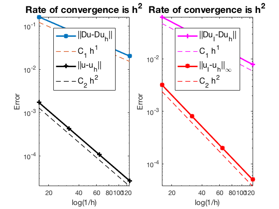

This example is to show the rate of convergence of the lowest order Weak Galerkin finite element
approximation of the Poisson equation on the unit square:

$$- \Delta u = f \; \hbox{in } (0,1)^2$$

for the following boundary conditions
- Non-empty Dirichlet boundary condition: $u=g_D \hbox{ on }\Gamma_D, \nabla u\cdot n=g_N \hbox{ on }\Gamma_N.$
- Pure Neumann boundary condition: $\nabla u\cdot n=g_N \hbox{ on } \partial \Omega$.
- Robin boundary condition: $g_R u + \nabla u\cdot n=g_N \hbox{ on }\partial \Omega$.

**References**:
- [Quick Introduction to Finite Element Methods]({{ site.baseurl }})
- [Introduction to Finite Element Methods](http://www.math.uci.edu/~chenlong/226/Ch2FEM.pdf)
- [Progamming of Weak Galerkin Methods](http://www.math.uci.edu/~chenlong/ifemdoc/fem/WGprogramming.pdf)


### Subroutines

- `PoissonWG`
- `squarePoissonWG`
- `femPoisson`
- `PoissonWGfemrate`
    
The method is implemented in `PoissonWG` subroutine and can be tested in `squarePoissonWG`. Together with other elements (P1, P2, P3, Q1), `femPoisson` provides a concise interface to solve Poisson equation. The P2 element is tested in `PoissonWGfemrate`. This doc is based on `PoissonWGfemrate`.

## The Lowest Order Weak Galerkin Element

The basis and the local matrices can be found in [Progamming of Weak Galerkin Methods](http://www.math.uci.edu/~chenlong/ifemdoc/fem/WGprogramming.pdf)

## Mixed boundary condition


```matlab
%% Setting
[node,elem] = squaremesh([0,1,0,1],0.25); 
mesh = struct('node',node,'elem',elem);
option.L0 = 2;
option.maxIt = 4;
option.printlevel = 1;
option.elemType = 'WG';
```


```matlab
% Mixed boundary condition
pde = sincosdata;
mesh.bdFlag = setboundary(node,elem,'Dirichlet','~(x==0)','Neumann','x==0');
femPoisson(mesh,pde,option);
```

    Multigrid V-cycle Preconditioner with Conjugate Gradient Method
    #dof:     3136,  #nnz:    14866, smoothing: (1,1), iter: 12,   err = 2.67e-09,   time =  0.1 s
    Multigrid V-cycle Preconditioner with Conjugate Gradient Method
    #dof:    12416,  #nnz:    55426, smoothing: (1,1), iter: 12,   err = 2.62e-09,   time = 0.097 s
    Multigrid V-cycle Preconditioner with Conjugate Gradient Method
    #dof:    49408,  #nnz:   238770, smoothing: (1,1), iter: 12,   err = 2.57e-09,   time = 0.18 s
    
     #Dof       h        ||u-u_h||    ||Du-Du_h||   ||DuI-Du_h|| ||uI-u_h||_{max}
    
      800   6.250e-02   1.71814e-03   1.62480e-01   6.33304e-02   3.20790e-03
     3136   3.125e-02   4.29635e-04   8.12679e-02   3.15253e-02   8.03198e-04
    12416   1.562e-02   1.07415e-04   4.06374e-02   1.57451e-02   2.00838e-04
    49408   7.812e-03   2.68539e-05   2.03191e-02   7.87036e-03   5.02182e-05
    
     #Dof   Assemble     Solve      Error      Mesh    
    
      800   9.00e-02   1.41e-02   9.00e-02   1.00e-02
     3136   7.00e-02   1.03e-01   4.00e-02   2.00e-02
    12416   1.30e-01   9.69e-02   5.00e-02   1.00e-01
    49408   3.00e-01   1.83e-01   1.10e-01   1.00e-01
    
    


    

    


    

    


## Pure Neumann boundary condition

When pure Neumann boundary condition is posed, i.e., $-\Delta u =f$ in $\Omega$ and $\nabla u\cdot n=g_N$ on $\partial \Omega$, the data should be consisitent in the sense that $\int_{\Omega} f \, dx + \int_{\partial \Omega} g \, ds = 0$. The solution is unique up to a constant. A post-process is applied such that the constraint $\int_{\Omega}u_h dx = 0$ is imposed. 


```matlab
option.plotflag = 0;
pde = sincosNeumanndata;
mesh.bdFlag = setboundary(node,elem,'Neumann');
femPoisson(mesh,pde,option);
```

    Multigrid V-cycle Preconditioner with Conjugate Gradient Method
    #dof:     3136,  #nnz:    15339, smoothing: (1,1), iter: 13,   err = 4.49e-09,   time = 0.066 s
    Multigrid V-cycle Preconditioner with Conjugate Gradient Method
    #dof:    12416,  #nnz:    56235, smoothing: (1,1), iter: 14,   err = 1.90e-09,   time = 0.07 s
    Multigrid V-cycle Preconditioner with Conjugate Gradient Method
    #dof:    49408,  #nnz:   240683, smoothing: (1,1), iter: 14,   err = 3.96e-09,   time = 0.24 s
    
     #Dof       h        ||u-u_h||    ||Du-Du_h||   ||DuI-Du_h|| ||uI-u_h||_{max}
    
      800   6.250e-02   1.76689e-02   6.83050e-01   5.49515e-01   2.27492e-01
     3136   3.125e-02   4.83700e-03   4.13444e-01   2.27292e-01   1.18952e-01
    12416   1.562e-02   1.28283e-03   2.09935e-01   1.07773e-01   7.44907e-02
    49408   7.812e-03   3.30853e-04   1.05872e-01   5.43084e-02   4.20973e-02
    
     #Dof   Assemble     Solve      Error      Mesh    
    
      800   7.00e-02   1.42e-03   3.00e-02   0.00e+00
     3136   1.00e-02   6.63e-02   2.00e-02   0.00e+00
    12416   7.00e-02   7.00e-02   3.00e-02   1.00e-02
    49408   2.70e-01   2.41e-01   1.30e-01   6.00e-02
    
    


    

    


## Robin boundary condition


```matlab
option.plotflag = 0;
pde = sincosRobindata;
mesh.bdFlag = setboundary(node,elem,'Robin');
femPoisson(mesh,pde,option);
```

    Multigrid V-cycle Preconditioner with Conjugate Gradient Method
    #dof:     3136,  #nnz:    15344, smoothing: (1,1), iter: 12,   err = 1.81e-09,   time = 0.05 s
    Multigrid V-cycle Preconditioner with Conjugate Gradient Method
    #dof:    12416,  #nnz:    56240, smoothing: (1,1), iter: 11,   err = 9.88e-09,   time = 0.051 s
    Multigrid V-cycle Preconditioner with Conjugate Gradient Method
    #dof:    49408,  #nnz:   240688, smoothing: (1,1), iter: 12,   err = 1.78e-09,   time = 0.18 s
    
     #Dof       h        ||u-u_h||    ||Du-Du_h||   ||DuI-Du_h|| ||uI-u_h||_{max}
    
      800   6.250e-02   8.89017e-03   6.48648e-01   2.60943e-01   1.69325e-02
     3136   3.125e-02   2.23100e-03   3.24914e-01   1.27079e-01   4.31205e-03
    12416   1.562e-02   5.58282e-04   1.62530e-01   6.31035e-02   1.08242e-03
    49408   7.812e-03   1.39604e-04   8.12741e-02   3.14968e-02   2.70809e-04
    
     #Dof   Assemble     Solve      Error      Mesh    
    
      800   4.00e-02   1.37e-03   0.00e+00   1.00e-02
     3136   2.00e-02   5.02e-02   1.00e-02   1.00e-02
    12416   5.00e-02   5.15e-02   5.00e-02   1.00e-02
    49408   2.10e-01   1.81e-01   1.00e-01   6.00e-02
    
    


    

    


## Conclusion

The optimal rate of convergence of the H1-norm (1st order) and L2-norm
(2nd order) is observed. No superconvergence for $\|\nabla u_I - \nabla u_h\|$.

MGCG converges uniformly in all cases.
