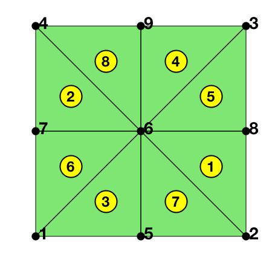
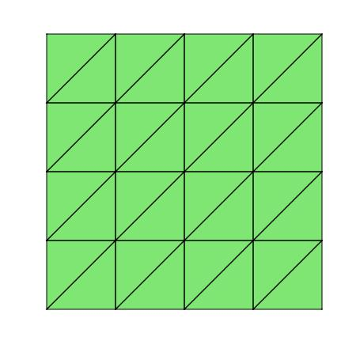
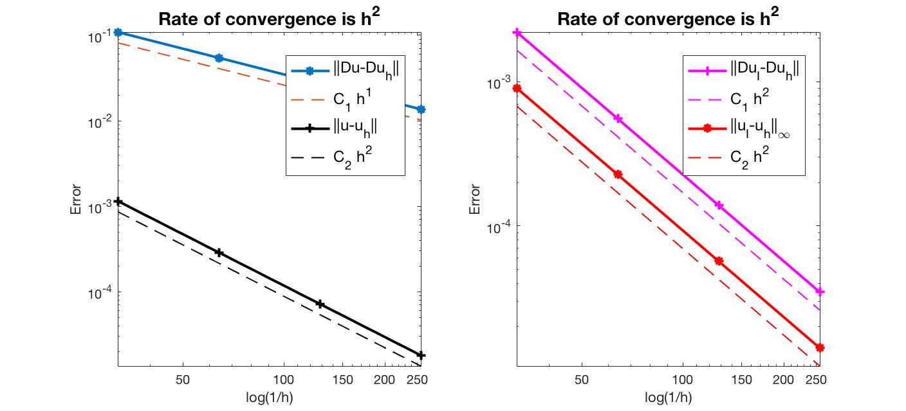
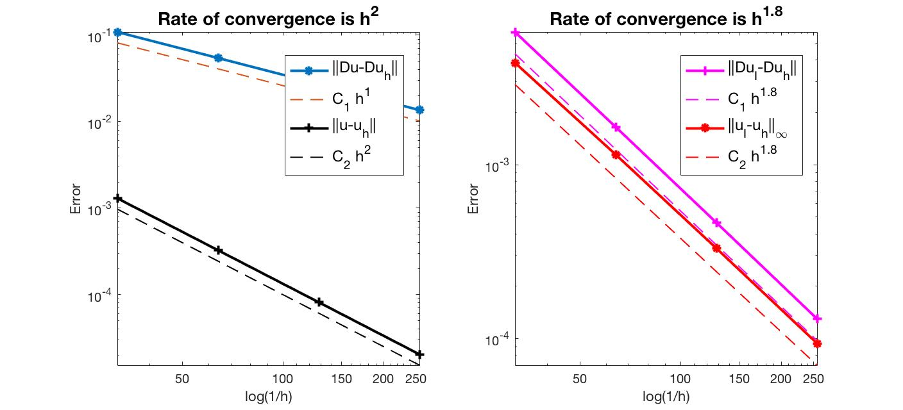

## Intro

This example is to show the rate of convergence of the linear finite element approximation of the Poisson equation on the unit square:

$$- \Delta u = f \; \hbox{in } (0,1)^2$$

for the following boundary conditions
- Non-empty Dirichlet boundary condition: $u=g_D \hbox{ on }\Gamma_D, \nabla u\cdot n=g_N \hbox{ on }\Gamma_N.$
- Pure Neumann boundary condition: $\nabla u\cdot n=g_N \hbox{ on } \partial \Omega$.
- Robin boundary condition: $g_R u + \nabla u\cdot n=g_N \hbox{ on }\partial \Omega$.

### References
- [Quick Introduction to Finite Element Methods]({{ site.baseurl }})
- [Introduction to Finite Element Methods](http://www.math.uci.edu/~chenlong/226/Ch2FEM.pdf)
- [Progamming of Finite Element Methods](http://www.math.uci.edu/~chenlong/226/Ch3FEMCode.pdf)

### Subroutines

- `Poisson`
- `squarePoisson`
- `femPoisson`
- `Poissonfemrate`
    
The method is implemented in `Poisson` subroutine and tested in `squarePoisson`. Together with other elements `(P1, P2, P3, Q1)`, `femPoisson` provides a concise interface to solve Poisson equation. The `P1` element is tested in `Poissonfemrate`. This doc is based on `Poissonfemrate`.    

## P1 Linear Element

For the linear element on a simplex, the local basis functions are
barycentric coordinate of vertices. The local to global pointer is
`elem`. This is the simplest and default element for elliptic equations.

### A local basis of P1

For $i = 1, 2, 3$, a local basis of the linear element space is given by the barycentric coordinate

$$\phi_i = \lambda_i, \quad \nabla \phi_i = \nabla \lambda_i = - \frac{|e_i|}{2|T|}\boldsymbol n_i, \quad \int_T \nabla \phi_i\nabla \phi_j = \frac{1}{4|T|}\boldsymbol l_i \cdot \boldsymbol l_j$$

where $e_i$ is the edge opposite to the $i$-th vertex and $\boldsymbol n_i$ is the unit outwards normal direction, and $\boldsymbol l_i$ is the edge vector of $e_i$.  

See [Finite Element Methods](http://www.math.uci.edu/~chenlong/226/Ch2FEM.pdf) Section 2.1 for geometric explanation of the barycentric coordinate and [Programming of Finite Element Methods in MATLAB](http://www.math.uci.edu/~chenlong/226/Ch3FEMcode.pdf) for detailed explanation. For P1 element, the basic data structure `node,elem` is sufficient and displayed for the following coarse mesh.


```matlab
imatlab_export_fig('print-jpeg')
node = [0,0; 1,0; 1,1; 0,1];
elem = [2,3,1; 4,1,3];      
[node,elem] = uniformbisect(node,elem);
figure('rend','painters','pos',[10 10 225 225])
showmesh(node,elem);
findnode(node);
findelem(node,elem);
display(elem);
```

    
    elem =
    
         8     6     2
         7     6     4
         5     6     1
         9     6     3
         8     3     6
         7     1     6
         5     2     6
         9     4     6
    


    

    


```matlab
% Setting
[node,elem] = squaremesh([0,1,0,1],0.25); 
mesh = struct('node',node,'elem',elem);
figure('rend','painters','pos',[10 10 225 225])
showmesh(node,elem);
option.L0 = 3;
option.maxIt = 4;
option.printlevel = 1;
```


    

    


## Mixed boundary condition


```matlab
option.plotflag = 0;
pde = sincosdata;
mesh.bdFlag = setboundary(node,elem,'Dirichlet','~(x==0)','Neumann','x==0');
femPoisson(mesh,pde,option);
```

    Warning: File: /Dropbox/Math/Programming/ifem/solver/mg.m Line: 695 Column: 24
    Defining "Di" in the nested function shares it with the parent function.  In a future release, to share "Di" between parent and nested functions, explicitly define it in the parent function.
    > In Poisson (line 233)
      In femPoisson (line 65)
    Multigrid V-cycle Preconditioner with Conjugate Gradient Method
    #dof:     4225,  #nnz:    19906, smoothing: (1,1), iter: 10,   err = 1.55e-09,   time = 0.11 s
    Multigrid V-cycle Preconditioner with Conjugate Gradient Method
    #dof:    16641,  #nnz:    80770, smoothing: (1,1), iter: 10,   err = 1.55e-09,   time = 0.096 s
    Multigrid V-cycle Preconditioner with Conjugate Gradient Method
    #dof:    66049,  #nnz:   325378, smoothing: (1,1), iter: 10,   err = 1.47e-09,   time =  0.2 s
    
     #Dof       h       ||u-u_h||    ||Du-Du_h||   ||DuI-Du_h|| ||uI-u_h||_{max}
    
     1089   3.12e-02   1.15027e-03   1.08974e-01   2.21506e-03   9.04547e-04
     4225   1.56e-02   2.88013e-04   5.45135e-02   5.54571e-04   2.26928e-04
    16641   7.81e-03   7.20310e-05   2.72601e-02   1.38693e-04   5.67600e-05
    66049   3.91e-03   1.80095e-05   1.36305e-02   3.46767e-05   1.41918e-05
    
     #Dof   Assemble     Solve      Error      Mesh    
    
     1089   7.00e-02   1.36e-02   9.00e-02   1.00e-02
     4225   3.00e-02   1.09e-01   4.00e-02   2.00e-02
    16641   1.10e-01   9.62e-02   8.00e-02   6.00e-02
    66049   4.00e-01   2.00e-01   2.30e-01   2.40e-01
    
    


    

    


## Pure Neumann boundary condition

When pure Neumann boundary condition is posed, i.e., $-\Delta u =f$ in $\Omega$ and $\nabla u\cdot n=g_N$ on $\partial \Omega$, the data should be consisitent in the sense that $\int_{\Omega} f \, dx + \int_{\partial \Omega} g \, ds = 0$. The solution is unique up to a constant. A post-process is applied such that the constraint $\int_{\Omega}u_h dx = 0$ is imposed. 


```matlab
option.plotflag = 0;
pde = sincosNeumanndata;
pde = sincosdata;
mesh.bdFlag = setboundary(node,elem,'Neumann');
femPoisson(mesh,pde,option);
```

    Multigrid V-cycle Preconditioner with Conjugate Gradient Method
    #dof:     4225,  #nnz:    20860, smoothing: (1,1), iter: 12,   err = 1.43e-09,   time = 0.03 s
    Multigrid V-cycle Preconditioner with Conjugate Gradient Method
    #dof:    16641,  #nnz:    82684, smoothing: (1,1), iter: 12,   err = 6.33e-09,   time = 0.08 s
    Multigrid V-cycle Preconditioner with Conjugate Gradient Method
    #dof:    66049,  #nnz:   329212, smoothing: (1,1), iter: 13,   err = 2.40e-09,   time = 0.26 s
    
     #Dof       h       ||u-u_h||    ||Du-Du_h||   ||DuI-Du_h|| ||uI-u_h||_{max}
    
     1089   3.12e-02   1.29973e-03   1.08855e-01   5.80361e-03   3.86104e-03
     4225   1.56e-02   3.25931e-04   5.44960e-02   1.64867e-03   1.14414e-03
    16641   7.81e-03   8.15520e-05   2.72576e-02   4.64515e-04   3.30465e-04
    66049   3.91e-03   2.03927e-05   1.36301e-02   1.29765e-04   9.37017e-05
    
     #Dof   Assemble     Solve      Error      Mesh    
    
     1089   5.00e-02   1.49e-03   2.00e-02   1.00e-02
     4225   2.00e-02   3.03e-02   3.00e-02   3.00e-02
    16641   8.00e-02   7.97e-02   6.00e-02   5.00e-02
    66049   4.00e-01   2.65e-01   3.00e-01   2.60e-01
    
    


    

    


## Robin boundary condition


```matlab
option.plotflag = 0;
pde = sincosRobindata;
mesh.bdFlag = setboundary(node,elem,'Robin');
femPoisson(mesh,pde,option);
```

    Multigrid V-cycle Preconditioner with Conjugate Gradient Method
    #dof:     4225,  #nnz:    20865, smoothing: (1,1), iter: 10,   err = 1.99e-09,   time = 0.018 s
    Multigrid V-cycle Preconditioner with Conjugate Gradient Method
    #dof:    16641,  #nnz:    82689, smoothing: (1,1), iter: 10,   err = 2.33e-09,   time = 0.062 s
    Multigrid V-cycle Preconditioner with Conjugate Gradient Method
    #dof:    66049,  #nnz:   329217, smoothing: (1,1), iter: 10,   err = 3.17e-09,   time = 0.21 s
    
     #Dof       h       ||u-u_h||    ||Du-Du_h||   ||DuI-Du_h|| ||uI-u_h||_{max}
    
     1089   3.12e-02   4.92975e-03   4.34581e-01   2.56571e-02   8.30859e-03
     4225   1.56e-02   1.24034e-03   2.17889e-01   6.44198e-03   2.08620e-03
    16641   7.81e-03   3.10581e-04   1.09020e-01   1.61223e-03   5.22032e-04
    66049   3.91e-03   7.76764e-05   5.45192e-02   4.03168e-04   1.30532e-04
    
     #Dof   Assemble     Solve      Error      Mesh    
    
     1089   5.00e-02   1.39e-03   0.00e+00   1.00e-02
     4225   2.00e-02   1.76e-02   2.00e-02   3.00e-02
    16641   8.00e-02   6.17e-02   6.00e-02   5.00e-02
    66049   4.90e-01   2.13e-01   2.50e-01   2.40e-01
    
    


    

    


## Conclusion

The optimal rate of convergence of the H1-norm (1st order) and L2-norm
(2nd order) is observed. The 2nd order convergent rate between two
discrete functions $\|\nabla (u_I - u_h)\|$ is known as superconvergence.

MGCG converges uniformly in all cases.
