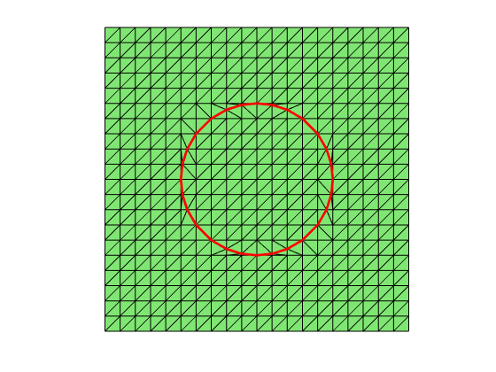
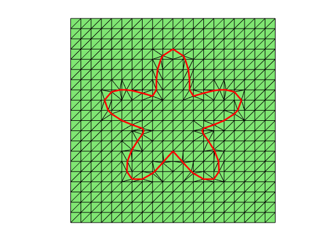
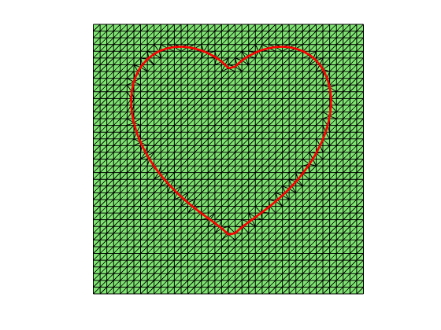

We provide several examples on using `interfacemesh` to generate an interface-fitted mmesh satisfying the maximum angle condition in two dimensions. We refer to [a simple interface mesh generator](interfacemeshdoc.html) for detailed explanation of the algorithm and `help interfacemesh` for input and output arguments.


```matlab
%% circle
box = [ -1, 1, -1, 1];
h = 0.1;
phi = @(p) sum(p.^2, 2) - 0.5.^2;
[node,elem,interface] = interfacemesh(box,phi,h);
showmesh(node,elem);
findedge(node,interface.edge,'all','noindex','draw');
```



    


```matlab
%% flower
[node,elem,interface] = interfacemesh(box,@phiflower,h);
showmesh(node,elem);
findedge(node,interface.edge,'all','noindex','draw');
```


​    

​    


```matlab
%% heart
[node,elem,interface] = interfacemesh(box,@phiheart,0.5*h);
showmesh(node,elem);
findedge(node,interface.edge,'all','noindex','draw');
```


​    

​    

