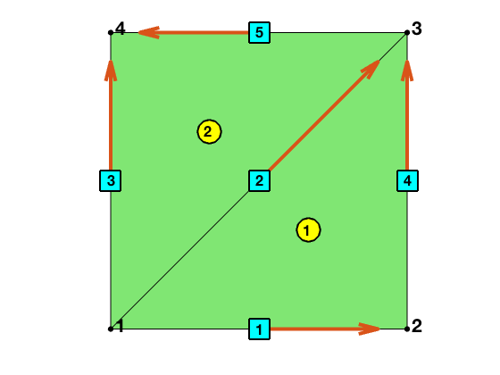

We describe the data structure of the simplicial complex associated to a
two-dimensional triangulation give by `node,elem`. The `node` records
the coordinates of vertices and `elem` is the pointer from the local to
the global indices of vertices. See [Basic mesh data structure]({{ site.baseurl }} ).

A brief summary.

- `edge`: asecond ordering ` edge(:,1)<edge(:,2);`
- `locEdge`: the default one is the consistent orientation which will be counter-clockwise if `elem` is positive ordered. The asecond orientation is used for edge elements.
  - consistent orientation `[2 3; 3 1; 1 2];`
  - asecond orientation    `[2 3; 1 3; 1 2];` 
- `elem`: the default one is positive ordering and the asecond ordering is used for edge elements. 
- Use `[elem,bdFlag] = sortelem(elem,bdFlag)` to change the ordering to the ascend ordering. Note that `bdFlag` should be switched together.  
- Use `[elem,idx,area,bdFlag] = fixorder(node,elem,bdFlag)` to change the ordering to the positive ordering.

> The multigrid solvers use the original ordering of `elem` obtained from either uniform refinement or bisection methods. So let `elemold=elem` and use `elemold` in `mg`.

- Examples on the usage: `PoissonRT0, PoissonBDM1`

## Outline


```matlab
node = [0,0; 1,0; 1,1; 0,1];    % nodes
elem = [2,3,1; 4,1,3];          % elements
N = size(node,1); NT = size(elem,1); % NE = size(edge,1); 
showmesh(node,elem);
findelem(node,elem);
findnode(node);
```


The basic data structure of a mesh consists of `node` and `elem`.
The integers `N, NE, NT, NE` represents the muber of vertice, edges, triangles, edges
respectively.

The corresponding simplicial complex consists of vertices, edges and
triangles. We shall discuss the following three issues:

- *Indexing* of simplexes
- *Ordering* of vertices of simplexes
- *Orientatoin* of simplexes

The indexing and ordering are related and the ordering and orientation
are mixed together. However the indexing has nothing to do with the
orientation. The indexing and ordering are the combinarotry structure,
i.e. only `elem` is needed, while the orientation also depends on `node`,
the geometry emembdding of vertices.

For indexing, ordering and orientation, there are always two versions: local and global. The pointer from the local and the global version is the most complicated issue.


## Indexing

The indexing refers to the numbering of simplexes, e.g., which edge is
numbered as the first one. Each simplex in the simplicial complex has a unique index which is called the global index. In one triangle, the three vertices and three
edges have their local index from 1:3. 

In the assembling procedure of finite element methods, an element-wise
matrix using the local index is firstly computed and then assembled to get a
big matrix using the global index. Thus the pointer from the local
index to the global one is indispensible. For bases independent of
the ordering and orientation, e.g., `P1` and `P2` elements, the pointer of indices
is sufficient. 

<!--Otherwise, the inconsistency of the local ordering/orientation-->
<!--and the global ordering/orientation should be taken into account.-->

### Pointers of vertices

The `NT x 3` matrix `elem` is indeed the pointer of the vertex indices. For example `elem(t,1)=25` means the first vertex of the triangle t is the 25-th vertex.

Similiary, the `NE x 2` matrix `edge` records the vertices pointer of edges.

### Local indexing of edges

The triangle constists of three vertices indexed as `[1,2,3]` and contains three edges. Consider two local indexing schemes for those edges:

* Opposite indexing     `locEdge = [2,3; 3,1; 1,2]`

In `locEdge`, the `i-th` edge is opposite to the `i-th` verices and thus
called _opposite indexing_.

* Lexicogrphic indexing `locEdgel = [1,2; 1,3; 2,3]`

In `locEdgel`, the indexing is induced from the lexicographic ordering of indices of the three edges.

Note that the ordering of vertices inside one edge will not change the indexing. For example, `locEdge = [2,3; 1,3; 1,2]` use the same opposite indexing but different ordering. For the 2nd edge, choosing `[1 3]` or `[3 1]`  depends on the consideration of orientation and ordering.

For 2-D triangulations, **we shall always chose opposite indexing**. The lexicographic indexing is mainly used in the construction of `face2edge` of 3-D triangulations; see [Simplicial Complex in Three Dimensions]({{ site.baseurl }}). 


### Global indexing of edges

One can easily collect all edges elementwise. The issue is the duplication. For example, each interior edge will be counted twice. The `unique` funciton can be applied such that each edge has a unique global index.


```matlab
totalEdge = uint32([elem(:,[2,3]); elem(:,[3,1]); elem(:,[1,2])]);
sortedTotalEdge = sort(totalEdge,2);
[edge,tempvar,je] = unique(sortedTotalEdge,'rows');
```


### Pointers of edges

`elem2edge(1:NT,1:3)` records the pointer from the local to the global index of edges. For example, `elem2edge(t,1)` = 10 means the first edge of triangle `t` (which is formed by [2 3] vertices of `t`) is the `10-th` one in the `edge` array.

Such information is stored in the third output of `unique` function and can be reshaped to the desired size: 
`elem2edge = uint32(reshape(je,NT,3));`

Note that the pointer `elem2edge` depends on the local indexing of edges
used in the generation of `totalEdge`. Here the opposite indexing of
three local edges is used.


## Ordering

We discuss the ordering of vertices of simplexes. The local and the global ordering  may not be consistent and a sign array can be used to record the inconsistency.

The local ordering refers to the ordering of local veritces. It will be used in the formulation of the local basis and thus the ordering does matter.

The global ordering refers to the ordering of the global index of vertices.

### elem
The local ordering is always `[1,2,3]`. Any permutation of three veritces of a triangle still represents the same triangle. Such freedom provide a room to record more information like: an global ordering of vertices, an orientation of triangles, and refinement rules

Two types of ordering is of particular importance

* positive ordering
* ascend ordering

In the positive ordering, the three vertices are ordered such that the
signed area, `det(v12,v13)`, is positive. If `elem` is not positive
ordered, `elem = fixorder(node,elem)` will compute the signed area and switch the vertices for triangles with negative areas.

For 2-D triangulations, three vertices of a triangle in 2-D is sorted
counter-clockwise and the first vertex is chosen as the newest vertex.
Such ordering enables the efficient implementation of the bisection refinement
and coarsening in 2-D; see [Bisection in Two Dimensions]({{ site.baseurl }})
and [Coarsening in Two Dimensions]({{ site.baseurl }}). **Positive ordering is the default choice and used in most places**.


In the ascend ordering, the vertices of `elem` is sorted ascendly according to the global index of indices, i.e.

    elem(t,1) < elem(t,2) < elem(t,3)

This can be easily achieved by `elem = sort(elem,2)`. However, one has to rotate the boundary flag accordingly using `sortelem`.


```matlab
bdFlag = setboundary(node,elem,'Dirichlet');
display('Before rotation'); display(elem); display(bdFlag);

[elem,bdFlag] = sortelem(elem,bdFlag);
display('After rotation'); display(elem); display(bdFlag);
```

    Before rotation
    
    elem =
    
         2     3     1
         4     1     3
    
    bdFlag =
    
        0    1    1
        0    1    1
    
    After rotation
    
    elem =
    
         1     2     3
         1     3     4
              
    bdFlag =
    
        1    0    1
        1    1    0     


​    

Ascend ordering will benefit the construction of local bases for high
order Lagrange elements or in general bases with orientation dependent.

We may switch the default positive ordering of `elem` to the ascend ordering
when generating data structure for finite element basis. However such
sorting is always hidden inside the subroutines; see `PoissonRT0` and `PoissonBDM1`.


### edge

The global ordering of edges is always ascended, i.e.

    edge(:,1) < edge(:,2);

Indeed in the generation of `edge`, the `totalEdge` is sorted to the
ascend ordering so that `unique` can be applied to eliminate the duplication.

Recall that we always use the opposite indexing of edges in two dimensions. With the same indexing, we may use

  - ascend ordering  `[2 3; 1 3; 1 2];` 
  - (orientation) consistent ordering `[2 3; 3 1; 1 2];`

It is consistent since the local ordering orientation of edges is consistent with the induced orientation as the boundary of a triangle; see the discussion on the orientation.

Even for the orientation consistent ordering, there might be an inconsistency between the local and global ordering.  Namely `edge(elem2edge(t,1),1) > edge(elem2edge(t,1),2)` may happen. 


## Orientation

The orientation of a triangle is the sign of the signed area. The orientation of an edge is given by a tangential or a normal vector, which is obtained by rotate a given tangential vector by 90 degree clockwise. When edges are  counter-clockwise orientated, the corresponding normal vector is the outwards normal vector.

The orientation of a d-simplex will induce an orientation of its d-1
subcomplex on the boundary and is called *the induced orientation*. For example, a positive
orientated triangle will induce the counter-clockwise orientation of its three edges.

The ordering of vertices will naturally introduce an orientation and will
be called *the ordering-orientation*. More specifically

- The vector from `edge(:,1)` to `edge(:,2)` defines an orientation of
edges.
- The sign of `det(v12,v13)` defines an orientation of triangles.

The orientation of a simplex in the simplicial complex should be uniquely determined which will be called _the global orientation_. It can be chosen as the global ordering-orientation but not always the case.

Inside one triangle, the local orientation of three edges is more involved. The local ordering of edges will introduce a local ordering orientation. The orientation of the triangle will also induce an induced orientation. The local ordering-orientation is used in the computation of local bases and the induced orientation is used when computing the
differential operator locally. They may or may not be consistent with
the global orientation of edges.

In general, there will be an inconsistency of the following types of
orientation of simplexes and appropriate data structure should be constructed to
record such inconsistency.

* a global orientation
* the global ordering-orientation
* the local ordering-orientation
* the local induced orientation

### elem
The orientation of a triangle is either positive or negative. For
the global ordering-orientation, it is the sign of the signed area
(output of `simplexvolume`). 

    [Dlambda,area,elemSign] = gradbasis(node,elem);

In the output of `gradbasis`, `area` is always positive and an additional
array `elemSign` is used to record the sign of the signed area.

`Dlambda(t,:,k)` is the gradient of the barycentric coordinate $\lambda_k$. Therefore the outward normal direction of the `k`th edge can be obtained by `-Dlambda(t,:,k)` which is independent of the ordering and orientation of triangle `t`.

### edge

For 2-D triangulations, **we shall always chose the global ascend ordering
orientation**, i.e., from the smaller index to the bigger index. 

The local ordering-orientation is implicitly used when computing finite
element basis in each element. For example, the edge element on edge `[i j]`
in `locEdge` is defined as

$$\phi_{i,j} = 2(\lambda_i \nabla \lambda_j - \lambda_j \nabla \lambda_i).$$ 

Permutation of `[i j]` to `[j i]` will change the sign of the basis. Note
that this is locally, i.e., element by element.

The global basis associated to this edge, however, depends only on its 
global orientation. The array `elem2edgeSign(1:NT, 1:3)`  records the inconsistency of a local ordering-orientation and the global orientation.

For the consistent local ordering `[2 3; 3 1; 1 2]` and the global ascend
ordering-orientation, the `elem2edgeSign` can be generated as follows:

    elem2edgeSign = ones(NT,3,'int8');
    totalEdge = uint32([elem(:,[2,3]); elem(:,[3,1]); elem(:,[1,2])]);
    idx = (totalEdge(:,1)>totalEdge(:,2));
    elem2edgeSign(idx) = -1;

There is one more inconsistency between the induced orientation and the
global orientation of edges. If a triangle is positive orientated, the
induced edge orientation should be given by the outwards (relative to a
triangle) normal vector. This induced orientation may not be consistent
with the global orientation of edges.

It depends on the ordering of `elem` and `locEdge`. When `elem` is
positive ordered and `locEdge` is consistently ordered, it is.

In the ascend ordering of `elem` and `edge`, we denote the direction as `+1`
if the direction of an edge is the same with the induced direction in a
certain elem, and `-1` otherwise. Then the consistency is given by
`elem2edgeSign = [+1 -1 +1];`

The second sign is `-1` because the local edge in the ascend ordering is `[1
3]` not `[3 1]`.

The `elem2edgeSign` will be used when assembling differential operators.
For example, when computing `div` operators on a positive orientated
triangle, the edge should have outwards normal direction or equivalently
the counter-clockwise orientation.


## Summary

We summarize the two popular ordering and orientation schemes below.

### Positive Ordering and Orientation

The vertices of the `elem` are sorted such that the area is always positive. i.e. the three vertices of the elem are ordered counter-clockwisely. Furthermore the first vertex is always the newest vertex of the triangle for the easy of the adaptive mesh refinement (bisection) and coarsening.

The local edge is using the opposite indexing and the consistent ordering

    locEdge = [2,3; 3,1; 1,2]

The ascend ordering is used for the global edges, i.e., `edge` is ascend sorted

     edge(:,1) < edge(:,2)

The inconsistency of the orientation is recorded in `elem2edgeSign` by

```matlab
totalEdge = uint32([elem(:,[2,3]); elem(:,[3,1]); elem(:,[1,2])]);
idx = (totalEdge(:,1)>totalEdge(:,2));
elem2edgeSign(idx) = -1;
```

**This is the default ordering and orientation scheme.** 


### Ascend Ordering and Orientation

For H(curl) and H(div) elements and high order (cubic and above) H(grad) elements, we will use the ascend ordering and orientation.

*Ordering*. The vertices of `elem` are sorted such that

    elem(t,1)<elem(t,2)<elem(t,3)

The ascend ordering is used for edges

    edge(:,1) < edge(:,2)

The local edge is also in the ascend ordering

    locEdge = [2,3; 1,3; 1,2]

The benefit of the ascend ordering: the ordering of local edges is consistent with the global ones and so is the corresponding orientation. So there is no need to use `elem2edgeSign` for the assembling of mass matrices. 

*Orientation*. We choose the ordering-orientation.

- `elem`: `sign(det(v12,v13))`
- `edge`: from the node with the smaller global index to the bigger one

The induced orientation inside one triangle may not be consistent with the ordering-orientation. Such inconsistency is recorded in 

    elem2edgeSign = [+1 -1 +1]

and will be used when computing the different operator by the incidence matrix, i.e., `div` operator. 

 

## Example


```matlab
node = [0,0; 1,0; 1,1; 0,1];    % nodes
elem = [2,3,1; 4,1,3];          % elements

%% Poistive ordering and orientation
[elem2edge,edge,elem2edgeSign] = dofedge(elem);
showmesh(node,elem);
findnode(node);
findelem(node,elem);
findedge(node,edge,'all','vec');
%%
display(elem);
display(edge);
display(elem2edge);
display(elem2edgeSign);
```


    elem =
    
         2     3     1
         4     1     3


​    
    edge =
    
               1           2
               1           3
               1           4
               2           3
               3           4


​    
    elem2edge =
    
               2           1           4
               2           5           3


​    
    elem2edgeSign =
    
        -1     1     1
         1     1    -1


​    
   

```matlab
node = [0,0; 1,0; 1,1; 0,1];    % nodes
elem = [2,3,1; 4,1,3];          % elements

%% Ascend Ordering and Orientation
bdFlag = setboundary(node,elem,'Dirichlet');
[elem,bdFlag] = sortelem(elem,bdFlag);
[elem2edge,edge,elem2edgeSign] = dofedge(elem);
showmesh(node,elem);
findnode(node);
findelem(node,elem);
findedge(node,edge,'all','vec');
display(elem);
display(edge);
display(elem2edge);
display(elem2edgeSign);
```


    elem =
    
         1     2     3
         1     3     4


​    
    edge =
    
               1           2
               1           3
               1           4
               2           3
               3           4


​    
    elem2edge =
    
               4           2           1
               5           3           2


​    
    elem2edgeSign =
    
         1    -1     1
         1    -1     1


    
