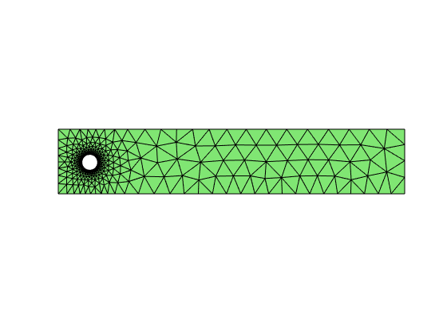

# Project: Transient Navier-Stokes Equations

The purpose of this project is to implement numerical methods for solving
time-dependent Navier-Stokes equations in two dimensions.

## Test problem: Flow past a cylinder

The domain is 

$$ (0,2.2)\times (0,0.41) - \{(x,y) | (x-0.2)^2+(y-0.2)^2 <= 0.05^2\}. $$

The center of the cylinder is slightly off the center of the channel
vertically which eventually leads to asymmetry in the flow. 

We are solving the Navier-Stokes equation

$$ \boldsymbol u_t -\nu \Delta \boldsymbol u + (\boldsymbol u\cdot \nabla) \boldsymbol u + \nabla p = f $$

$$ \nabla \cdot \boldsymbol u = 0 $$

The time-dependent inflow boundary condition on the left is

$$ \boldsymbol u(t,0,y) = 0.41^{-2}\sin(\pi t/8)(6y(0.41-y), 0) $$

The outflow boundary condition on the right $$ \{x= 2.2\} $$ is

$$ \nu \partial_n \boldsymbol u - p \boldsymbol n = 0 $$

On the other part of the boundary, no-slip boundary condition $$ \boldsymbol u = 0 $$
is imposed.

The initial condition is zero $$ \boldsymbol u(0; x,y) = \boldsymbol 0. $$

The body force is zero too $$ \boldsymbol f = \boldsymbol 0. $$

We choose $$ \nu = 10^{-3}. $$ Since the maximum velocity is one and the
diameter of the cylinder is 0.1, the Reynolds number of the flow is 100.

## Step 1: Mesh

Download the mesh [flowpastcylindermesh.mat](http://math.uci.edu/~chenlong/226/flowpastcylindermesh.mat) and load it in Matlab.


```matlab
load flowpastcylindermesh
showmesh(node,elem);
```


    

    


Uniform refine this coarse grid, and project the circular
part back to the circle.

## Step 2: FEM for convection-diffusion-reaction equations

Choose either non-conforming P1 - P0 or iso P2-P0 elements.

Besides the matrix for Laplacian and divergence operator, you need to
compute one more matrix for the convection term $$ ((\boldsymbol w\cdot \nabla)\boldsymbol u, \boldsymbol \phi) $$
and the mass matrix for the reaction term $$ ( \boldsymbol u, \boldsymbol \phi). $$

The mass matrix for non-conforming P1 is diagonal. For P1 element, use
mass lumping to compute a diagonal mass matrix.

For convection term, first write out component-wise weakformulation and
compute the element-wise entry and finally assemble the matrix. Note that
the derivative of a linear basis is constant which can be factor out the
integral and one-point quadrature is good enough.

Test your code for a scalar convection-diffusion-reaction equation

$$ - \Delta u + w_1 \partial _x u + w_2 \partial _y u + \alpha u = f $$

by choosing a smooth function and moderate convection coefficient.

## Step 3: Time Discretization and Nonlinear Iteration

* Implement Crack-Nicolson method for time discretization with `dt = 0.0025`  which leads in each discrete time step to a non-linear system of equations.

* Use Picard (fixed point) iteration to solve the nonlinear problem. The fixed point iteration was stopped if the Euclidean norm of the residual vector was less than `1e-8`.

* Discretization of the linear systems in space by either non-conforming P1 - P0 or isoP2-P0 elements. Solve the algebraic system using direct solver (backslash) in Matlab.

## Step 4: GMRES method for solving the linearied problem

Suppose the linear saddle point system system is $\begin{pmatrix}F & B'\\ B & 0 \end{pmatrix}$. Use the block-triangular preconditioner $\begin{pmatrix}F & B'\\ 0 & -BF^{-1}B'\end{pmatrix}^{-1}$ and `gmres` to solve the linear system to the tolerence `1e-6`. 

The inverse of the Schur complement is approximated by the
least-square commutator

$$ (BF^{-1}B')^{-1} \approx A_p^{-1}F_pA_p^{-1} $$

where 

$$ F_p = BM_u^{-1}FM_h^{-1}B', \quad A_p = BM_u^{-1}B'. $$

The Poisson solver $A_p^{-1}$ can be replaced by the direct solver or
one V-cycle.

## Step 5: Evaluation of the Computational Results
